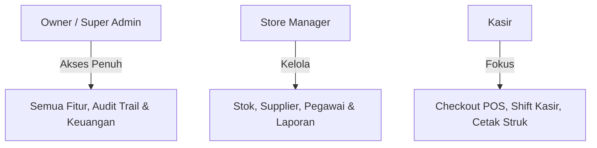
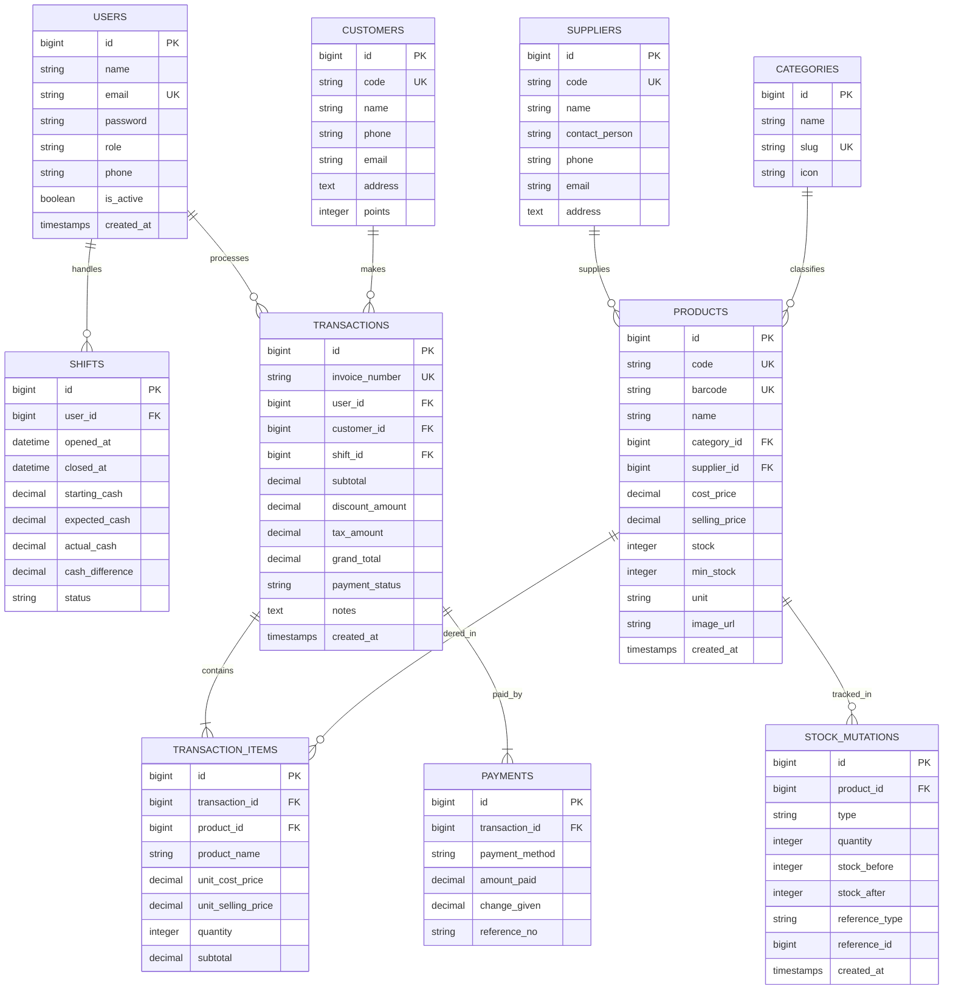

# Product Requirements Document (PRD)
## Sistem Kasir Modern (DragonMart POS)

---

## 1. Executive Summary & Visi Produk

### 1.1 Latar Belakang
Sistem kasir sebelumnya (`projectkasir_old / kasirdragon`) merupakan aplikasi POS monolitik berbasis **PHP Native** dan MySQL prosedural dengan antarmuka Bootstrap 5. Meskipun telah mencakup fungsionalitas dasar seperti pencatatan barang, supplier, pelanggan, shift pegawai, transaksi tunggal, dan laporan sederhana, sistem lama memiliki keterbatasan arsitektural yang signifikan, celah keamanan (plain text password, SQL injection risk), ketiadaan sistem keranjang belanja multi-item (*shopping cart*), serta performa yang tidak siap untuk skala bisnis modern.

### 1.2 Visi Produk
Membangun ulang sistem menjadi **DragonMart POS Modern**: platform *Point of Sale* (POS) performa tinggi, aman, dan modular dengan pemisahan arsitektur yang tegas:
- **Backend**: RESTful API berbasis **Laravel 11** (arsitektur Repository-Service, Laravel Sanctum, Spatie Permission).
- **Frontend**: Single Page Application interaktif berbasis **Next.js (App Router, TypeScript, Tailwind CSS)** dengan antarmuka kasir cepat, offline-resilient, dan siap cetak thermal printer (58mm/80mm).

---

## 2. Analisis & Audit Sistem Lama (`projectkasir_old`)

Dari penelusuran seluruh berkas kode sumber dan skema SQL pada `projectkasir_old`, berikut hasil audit mendalam:

### 2.1 Entitas & Modul yang Ada pada Sistem Lama
| Modul Lama | Berkas Utama | Analisis Fungsi Lama | Celah / Kelemahan Kritis |
| :--- | :--- | :--- | :--- |
| **Autentikasi** | `login.php`, `cek_login.php` | Login dual-table (`user` untuk admin, `pegawai` untuk pegawai) | Password disimpan dalam bentuk plain text tanpa hash, query rentan SQL Injection, tidak ada session timeout/revocation. |
| **Katalog Barang** | `barang.php`, `jenis_barang.php` | Input barang, stok, harga, jenis barang, supplier | Validasi lemah, tidak ada riwayat perubahan stok (*stock card/log*), tidak ada harga modal (*cost of goods sold* / HPP) untuk kalkulasi profit bersih. |
| **Supplier** | `supplier.php`, `laporan_supplier.php` | CRUD supplier dan relasi barang ke supplier | Relasi one-to-many kaku; satu barang hanya bisa berasal dari 1 supplier. |
| **Pegawai & Shift** | `pegawai.php`, `kasir.php` | Pengaturan shift pegawai (Pagi=1, Sore=2, Malam=3) dengan tombol randomizer | Data pegawai terpisah dari tabel `user` dan `kasir`, tidak ada pencatatan kas modal awal (*cash drawer/float*) saat shift dibuka. |
| **Pelanggan** | `pelanggan.php`, `tambah_pelanggan.php` | Manajemen data member (nama, no_tlp, email, gender) | Tidak ada sistem reward/point loyalty, belum ada integrasi pencarian instan pada kasir. |
| **Transaksi POS** | `transaksi.php` | Pemrosesan penjualan satu per satu barang, pengurangan stok otomatis, cetak struk browser | **Kelemahan paling fatal**: Transaksi hanya bisa membeli 1 jenis barang per submit. Tidak ada fitur keranjang belanja multi-item dinamis sebelum bayar. Tidak ada kalkulasi uang kembalian dan metode non-tunai (QRIS/Transfer). |
| **Detail Transaksi** | `detail_transaksi.php` | Riwayat baris transaksi | Tabel `transaksi` masih menyimpan `kode_barang` tunggal di header, menyebabkan anomali denormalisasi terhadap tabel `detail_transaksi`. |
| **Faktur & Invoice** | `faktur.php` | Tabel faktur terpisah (`no_faktur`, `tgl_faktur`, `id_pembeli`) | Tidak terintegrasi otomatis dengan tabel `transaksi`. |
| **Order Barang** | `order.php` | Pencatatan pesanan sederhana (`kode_order`, `jenis_order`, `kode_barang`) | Format data statis dan belum memiliki workflow status (Pending, Diproses, Diterima). |
| **Laporan & Analitik** | `laporan_transaksi.php`, `laporan_supplier.php` | Filter rentang tanggal, ringkasan omzet, top 5 produk, grafik harian | Query langsung ke database tanpa agregasi cache, belum ada laporan laba/rugi (profit margin) dan ekspor PDF resmi. |

---

## 3. Target Pengguna & Role-Based Access Control (RBAC)

Sistem baru menggunakan model hak akses terpusat berbasis **Spatie Laravel Permission**:

### 3.1 Matriks Wewenang Pengguna
| Fitur / Modul | Super Admin (Owner) | Store Manager | Kasir |
| :--- | :---: | :---: | :---: |
| Dashboard Finansial & Profit Margin | ✅ | ✅ | ❌ |
| Transaksi Checkout POS & Keranjang | ✅ | ✅ | ✅ |
| Buka / Tutup Shift & Rekap Kas Laci | ✅ | ✅ | ✅ |
| Retur Transaksi / Batalkan Pesanan | ✅ (Otorisasi) | ✅ (Otorisasi) | Perlu PIN Supervisor |
| CRUD Master Barang & Kategori | ✅ | ✅ | Read Only |
| Penyesuaian Stok (Stock Opname) | ✅ | ✅ | ❌ |
| CRUD Data Supplier & Pembelian (PO) | ✅ | ✅ | ❌ |
| Manajemen Pegawai & Akun Kasir | ✅ | ✅ (Non-Admin) | ❌ |
| Manajemen Data Pelanggan / Member | ✅ | ✅ | ✅ (Tambah & Cari) |
| Laporan & Ekspor (Excel, PDF) | ✅ | ✅ | Hanya Ringkasan Shift Sendiri |
| Audit Trail / Activity Log | ✅ | ❌ | ❌ |

---

## 4. Kebutuhan Fungsional (Functional Requirements)

### Modul 1: Autentikasi & Akun
- **FR-AUTH-01**: Login terpusat berbasis email/username dengan enkripsi password standar industri (Bcrypt/Argon2id).
- **FR-AUTH-02**: Penerbitan token akses aman menggunakan **Laravel Sanctum** dengan mekanisme auto-refresh dan masa kedaluwarsa.
- **FR-AUTH-03**: Manajemen profil pengguna (ubah nama, avatar, ubah password mandiri).
- **FR-AUTH-04**: Role-based routing guard pada Frontend Next.js untuk mencegah akses menu yang tidak berhak.

### Modul 2: Master Data & Manajemen Produk
- **FR-PROD-01**: Manajemen kategori / jenis barang secara hierarkis (dengan slug dan ikon).
- **FR-PROD-02**: Manajemen produk mencakup:
  - Kode unik barang / Barcode (EAN-13 / SKU).
  - Nama barang dan deskripsi singkat.
  - Kategori (relasi ke `categories`).
  - Supplier utama (relasi ke `suppliers`).
  - Harga Modal (HPP / *Cost Price*) & Harga Jual (*Selling Price*).
  - Stok fisik, stok minimum (*safety stock*), dan satuan unit (Pcs, Box, Pack, Kg).
  - Upload gambar produk dengan optimasi webp instan.
- **FR-PROD-03**: Notifikasi otomatis ketika stok barang mencapai atau berada di bawah stok minimum.

### Modul 3: Manajemen Supplier & Pengadaan (Purchasing)
- **FR-SUPP-01**: CRUD data supplier (nama, kontak PIC, no telepon, email, alamat lengkap).
- **FR-SUPP-02**: Pencatatan riwayat barang masuk dari supplier untuk menambah stok secara akurat beserta catatan harga beli.

### Modul 4: Kasir & Engine Transaksi POS (Core Engine)
- **FR-POS-01 (Katalog Cepat & Barcode)**: 
  - Input transaksi mendukung pencarian nama instan dan scan barcode menggunakan scanner optik/keyboard emulation.
  - Tombol cepat kategori (*category pill tabs*) untuk navigasi visual di layar sentuh (*touchscreen*).
- **FR-POS-02 (Keranjang Belanja Dinamis / Shopping Cart)**:
  - Penambahan barang multi-item ke dalam keranjang aktif.
  - Pengaturan kuantitas instan (+ / - / ketik manual).
  - Validasi stok realtime (mencegah checkout melebihi stok yang tersedia).
  - Penghapusan item atau reset keranjang dengan konfirmasi.
- **FR-POS-03 (Member & Diskon)**:
  - Pemilihan pelanggan terdaftar atau mode "Pelanggan Umum / Guest".
  - Penerapan diskon per item atau diskon global (persentase atau nominal rupiah).
  - Kalkulasi pajak otomatis (PPN dapat dikonfigurasi aktif/nonaktif).
- **FR-POS-04 (Multi-Payment & Kembalian)**:
  - Dukungan metode bayar: **Tunai (Cash)**, **QRIS Dinamis/Statis**, **Debit / EDC**, dan **Transfer Bank**.
  - Pilihan pecahan uang cepat (contoh: Uang Pas, Rp 20.000, Rp 50.000, Rp 100.000).
  - Kalkulasi uang kembalian otomatis (*change amount*) dengan peringatan jika pembayaran kurang.
- **FR-POS-05 (Cetak Struk & Invoice)**:
  - Format cetak struk termal standar 58mm & 80mm via dialog `window.print()` atau direct raw thermal printer command.
  - Ringkasan struk memuat: Logo toko, nama kasir, nomor transaksi unik, detail barang, total, metode bayar, nominal bayar, kembalian, dan ucapan terima kasih.

### Modul 5: Manajemen Shift Kasir (Cash Drawer & Reconciliation)
- **FR-SHIFT-01**: Buka Shift: Kasir wajib memasukkan modal uang kas awal laci (*cash float*) sebelum memulai transaksi.
- **FR-SHIFT-02**: Tutup Shift: Kasir menghitung uang fisik di laci dan sistem mencocokkannya dengan total transaksi sistem (*expected cash vs actual cash*).
- **FR-SHIFT-03**: Cetak ringkasan shift (*X-Report / Z-Report*) untuk pelaporan ke supervisor.

### Modul 6: Laporan & Analitik Bisnis
- **FR-REP-01**: Dashboard ringkasan eksekutif:
  - Total omzet penjualan hari ini, minggu ini, dan bulan ini.
  - Keuntungan kotor (Gross Profit) = Total Penjualan - Total HPP.
  - Jumlah transaksi & rata-rata nilai transaksi (*average basket size*).
  - Grafik tren penjualan harian/bulanan interaktif.
- **FR-REP-02**: Laporan Produk Terlaris (*Top 10 Best Sellers*) berdasarkan kuantitas dan nilai omzet.
- **FR-REP-03**: Laporan Stok Barang & Valuasi Aset (total nilai modal barang di gudang/toko).
- **FR-REP-04**: Fitur ekspor laporan ke format **Excel (.xlsx)** dan **PDF**.

---

## 5. Kebutuhan Non-Fungsional (Non-Functional Requirements)

1. **Performa**:
   - Respon endpoint REST API backend rata-rata di bawah **150ms**.
   - Waktu render UI keranjang kasir instan tanpa *stuttering* saat keranjang menampung hingga 50+ item.
2. **Keamanan**:
   - Enkripsi password menggunakan `bcrypt` dengan cost factor 12.
   - Proteksi penuh terhadap SQL Injection melalui Eloquent ORM & PDO prepared statements.
   - Proteksi Cross-Origin Resource Sharing (CORS) ketat dan CSRF/Token handling via Sanctum.
   - Rate limiting pada rute otentikasi (maksimal 5 kali percobaan gagal per menit).
3. **Keandalan & Transaksi Database**:
   - Pengurangan stok barang dan pembuatan invoice wajib dibungkus dalam **Database Transaction** (`DB::beginTransaction()` / `commit()`) untuk mencegah stok berkurang jika pencatatan transaksi gagal (*atomicity*).
4. **Desain & Responsivitas (Sesuai Aturan Project)**:
   - Antarmuka POS dioptimalkan untuk desktop, tablet kasir (touchscreen), dan layar mobile.
   - Tidak menggunakan elemen kloning generik; tata letak disesuaikan dengan alur kasir ritel nyata (*ergonomic cashier flow*).

---

## 6. Perancangan Skema Database Baru (Relational ERD)

Skema database lama disempurnakan menjadi bentuk normalisasi ketiga (3NF) dengan integritas referensial yang kuat:

---

## 7. Rencana Integrasi 5 Fase Sesuai Roadmap Project

PRD ini dirancang berkesinambungan dengan aturan roadmap pengembangan yang telah disepakati:

### 7.1 Tahapan Backend (Branch: `fase/backend`)
1. **Fase 1 – Database**:
   - `01. Migrations`: Migrasi tabel terstruktur (`users`, `categories`, `suppliers`, `products`, `customers`, `shifts`, `transactions`, `transaction_items`, `payments`, `stock_mutations`).
   - `02. Models & Relations`: Eloquent Models dengan casts tipe mata uang, relasi HasMany/BelongsTo, dan scopes.
   - `03. Factories`: Mock data produk ritel, supplier, dan pelanggan untuk pengujian volume data besar.
   - `04. Seeders`: Seeder akun Admin & Kasir awal, kategori default, dan migrasi data awal dari `projectkasir_old`.
2. **Fase 2 – Core Application**:
   - `05. Repository Layer`: Abstraksi kueri database (ProductRepository, TransactionRepository, ReportRepository).
   - `06. Service Layer`: POSCheckoutService, StockMutationService, ShiftReconciliationService.
   - `07. Form Requests`: Validasi ketat checkout, penambahan stok, dan pembuatan master produk.
   - `08. Policies & Permissions`: Pengaturan izin aksi (Cashier hanya bisa transaksi dan buka/tutup shift miliknya).
3. **Fase 3 – REST API**:
   - `09. Controllers`: Thin RESTful controllers.
   - `10. API Resources`: Format data JSON standar konsisten `{ success: true, data: ..., message: ... }`.
   - `11. Routes & Middleware`: Route v1 terstruktur dengan Sanctum middleware dan role middleware.
   - `12. Authentication`: Login, logout, current user check, refresh token.
4. **Fase 4 – Integration**:
   - `13. Spatie Media Library`: Upload foto produk dan bukti struk.
   - `14. Spatie Activitylog`: Catat audit trail setiap perubahan harga, stok, dan penghapusan data.
   - `15. Redis & Queue`: Cache data produk aktif & antrean generate laporan omzet bulanan.
   - `16. Events & Notifications`: Broadcast alert stok habis dan notifikasi transaksi baru.
5. **Fase 5 – Quality & Release**:
   - `17. Tests & API Docs`: PHPUnit Feature Tests untuk POS Checkout & Dokumentasi endpoint Swagger/Postman.
   - `18. Deployment & Monitoring`: Optimasi konfigurasi server produksi -> **PRODUCTION READY**.

### 7.2 Tahapan Frontend (Branch: `fase/frontend`)
1. **Fase 1 – Foundation**: Setup Next.js App Router, konfigurasi environment variable API backend, arsitektur folder.
2. **Fase 2 – Core Architecture**: TypeScript types dari skema API, Axios/Fetch interceptor dengan bearer token, route guard middleware.
3. **Fase 3 – UI Development**: Layout dashboard kasir, komponen tombol kalkulator, input numerik uang, tabel transaksi interaktif, dialog modal.
4. **Fase 4 – Feature Integration**: Custom hooks keranjang kasir (`useCart`), checkout modal dengan perhitungan kembalian, integrasi form validation Zod.
5. **Fase 5 – Quality & Release**: Optimasi cetak termal (`@media print`), skeleton loading, error handling elegan, dan validasi production build -> **PRODUCTION READY**.

---

## 8. Kesimpulan & Langkah Eksekusi Berikutnya

Dengan disahkannya PRD ini:
1. Kode sumber lama pada `projectkasir_old` tetap dipertahankan tanpa perubahan apapun.
2. Seluruh perancangan fitur baru siap dieksekusi secara terstruktur mulai dari **Fase 1 Database pada Backend (`fase/backend`)** hingga integrasi **Frontend (`fase/frontend`)**.
